# Todo List App
A mobile application for managing a todo-list. The application was built solely for the purpose of practicing React-Native, TypeScript, and Realm. The application has a few basic features such as creating, updating, and deleting todo items. The user can also filter todo items by completion status (e.g. "completed", "overdue", and "open"). Additionally, the application sends out a push notification to the user when the task is due.

## Technologies
* React-Native
* TypeScript
* CSS
* Realm
* Android
* Android Studio (for simulation)

# Images (using Android Studio Galaxy_Nexus_API_29 simulator)

## Home screen before adding tasks.
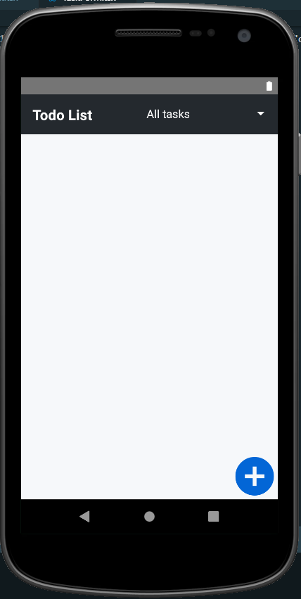

## After clicking blue "Add Task" button.
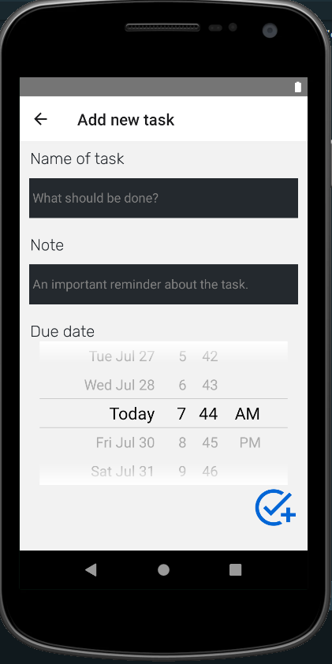

## After trying to add invalid task.
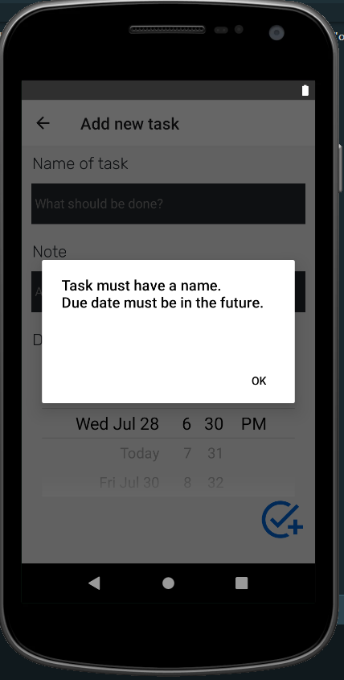

## After filling out form for new task.
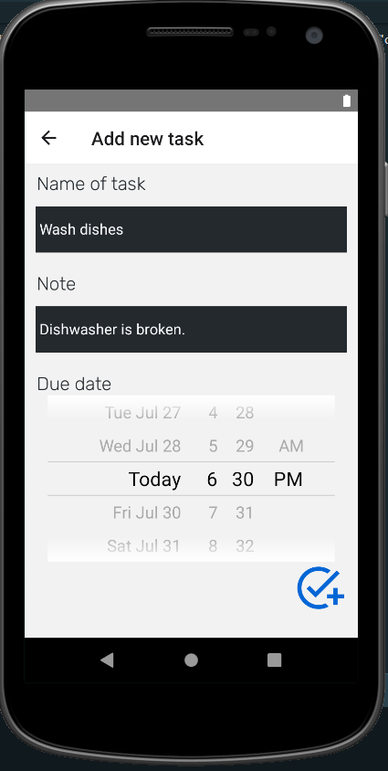

## After submitting form for new task.
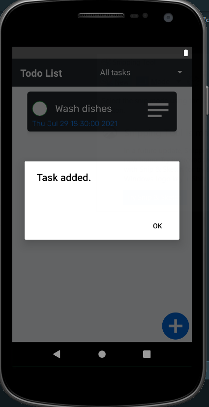

## Home screen after adding multiple tasks.
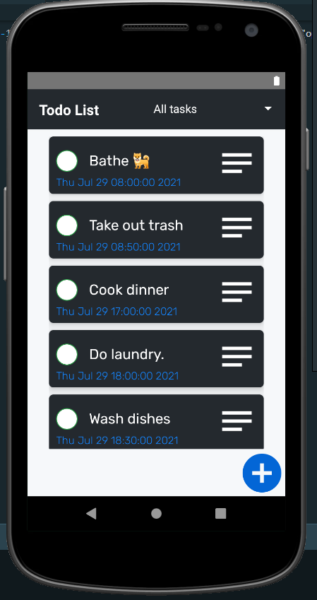

## After clicking "Update Task" icon (icon with three lines, located on the right of each task)
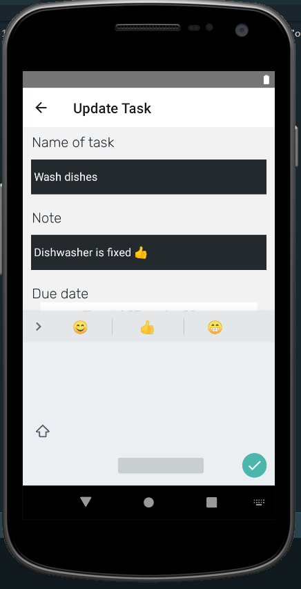

## After submitting valid update.
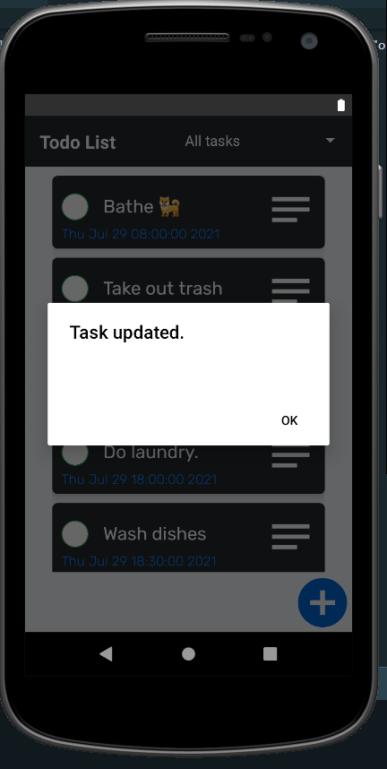

## After clicking "complete task" button (circle located on the left of each task) for multiple tasks.
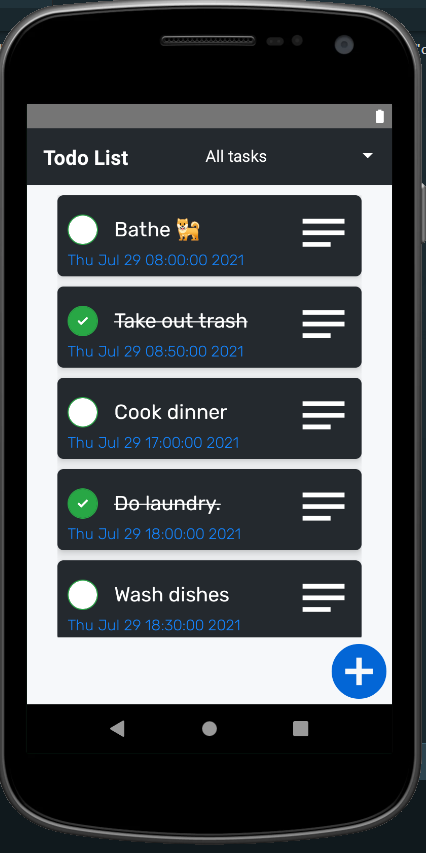

## After changing filter (located on the upper right) to "Completed tasks"
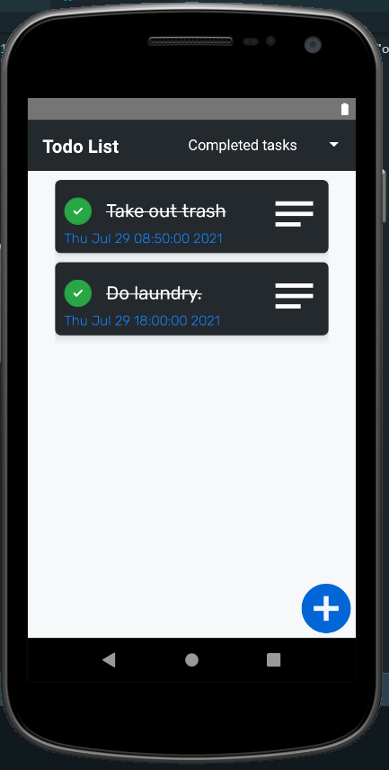

## Home screen after one task becomes overdue (timestamp turns red).
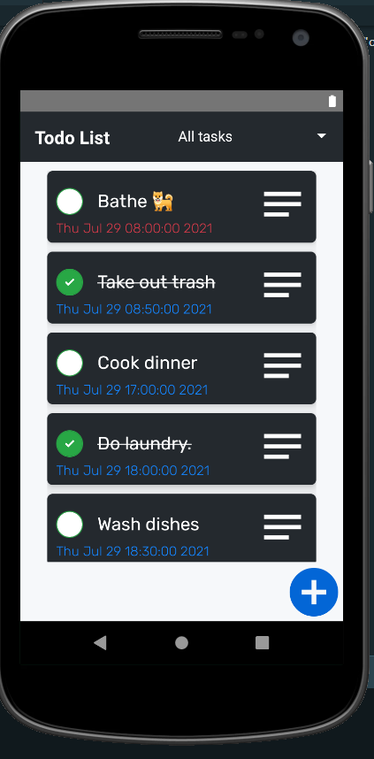

## Receiving a notification for a task that is due (the simulator doesn't allows display text properly, but the notifications, keyboard, etc display properly when using actual device).
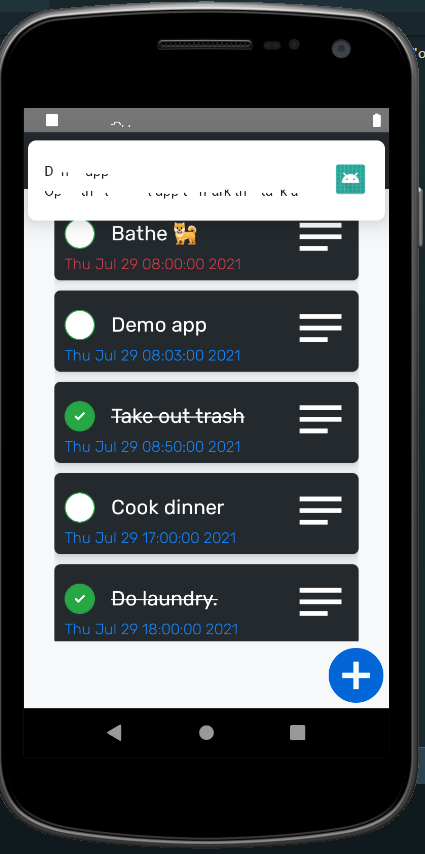

## Another view of notification.
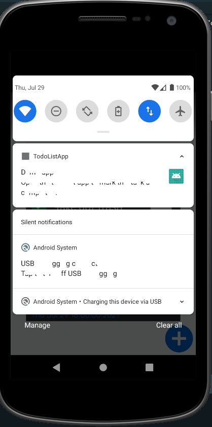

## After clicking on "Update Task" button for task: "Demo app".
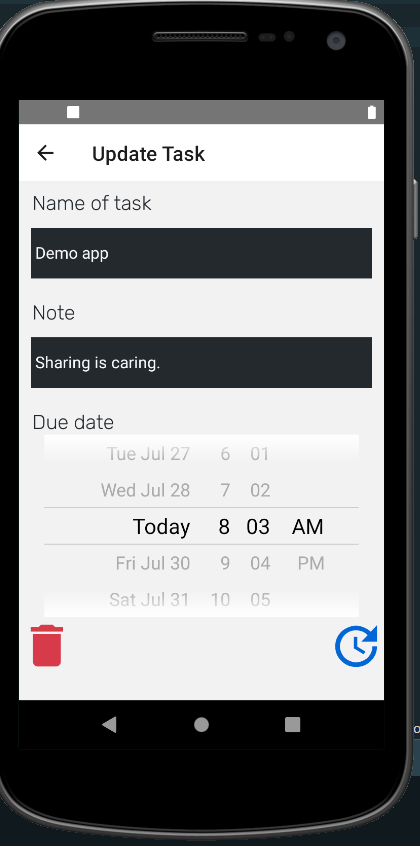

## After deleting "Demo app" task.
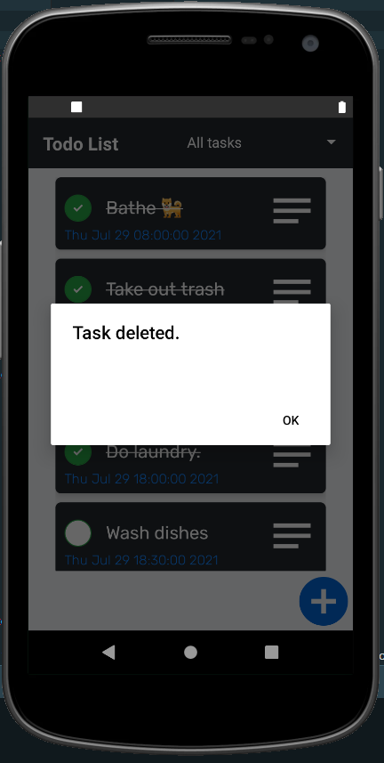